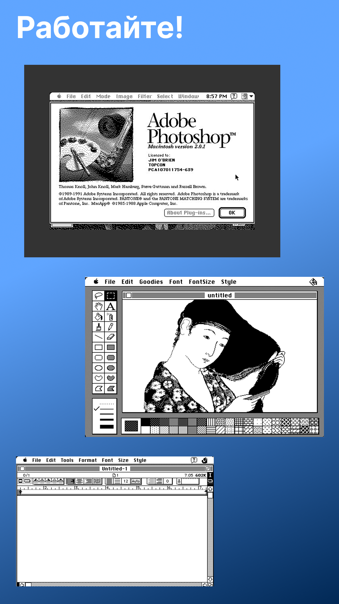

# Mini vMac for Aurora OS

## Introduction
This is a port of SDL2 version of Mini vMac
- Supports audio
- Supports video at 512x384 (scales automatically) with 256 colors
- Supports touch
- Supports landscape mode
- Supports external mouse & keyboard

due to Mini vMac architecture, only one resolution is available (for now)

## Guide
- Copy MacII.ROM to ~/.local/share/ru.erhoof/minivmac/MacII.ROM
- Find any Mini vMac OS (like '7.5US_40MB.img', search for 'MacOS_753.zip' at Macintosh Garden)
- Rename it to 'boot.img' and place to ~/.local/share/ru.erhoof/minivmac/boot.img

## Roadmap
- Add dynamic resolution detection
- Add virtual keyboard support
- Add configuring frontend

## Release
v0.1 is available on Releases page

## Screenshots

## Promote materials

